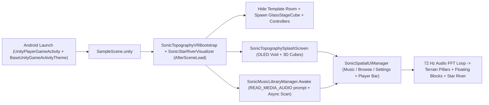

# Scene Flow

Last updated: 2026-11-22

AudioFloor runs inside a single active runtime scene (`Assets/Scenes/SampleScene.unity`). `Assets/Scenes/BasicScene.unity` is an unused template scene.

```mermaid
graph LR
    Launch["Android Launch (UnityPlayerGameActivity + BaseUnityGameActivityTheme)"] --> SceneLoad["SampleScene.unity"]
    SceneLoad --> Boot["SonicTopographyVRBootstrap + SonicStarRiverVisualizer (AfterSceneLoad)"]
    Boot --> Env["Hide Template Room + Spawn GlassStageCube + Controllers"]
    Boot --> Perm["SonicMusicLibraryManager.Awake (READ_MEDIA_AUDIO prompt + Async Scan)"]
    Boot --> Splash["SonicTopographySplashScreen (OLED Void + 3D Cubes)"]
    Splash --> UI["SonicSpatialUIManager (Music / Browse / Settings + Player Bar)"]
    Perm --> UI
    UI --> Loop["72 Hz Audio FFT Loop -> Terrain Pillars + Floating Blocks + Star River"]
```
